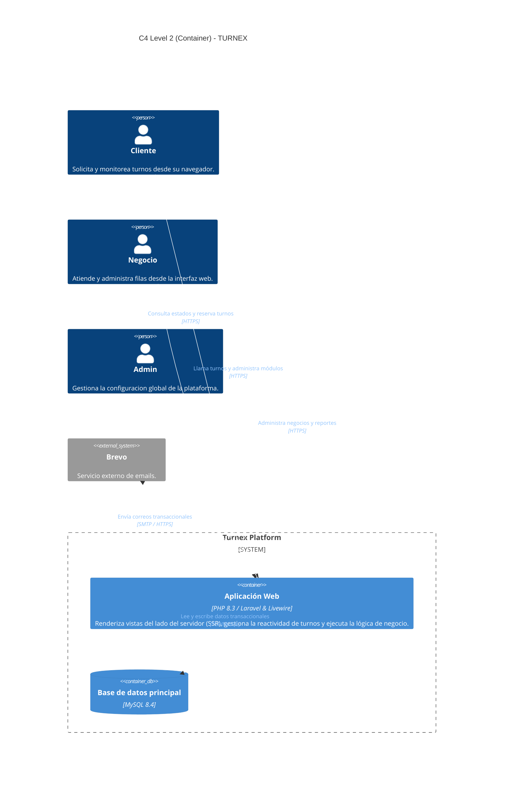

```mermaid
C4Container
title C4 Level 2 (Container) - TURNEX

Person(customer,"Cliente","Solicita y monitorea turnos desde su navegador.")
Person(business,"Negocio","Atiende y administra filas desde la interfaz web.")
Person(admin,"Admin","Gestiona la configuracion global de la plataforma.")

System_Ext(brevo,"Brevo","Servicio externo de emails.")

System_Boundary(turnex_boundary,"Turnex Platform") {
    Container(web_app, "Aplicación Web", "PHP 8.3 / Laravel & Livewire", "Renderiza vistas del lado del servidor (SSR), gestiona la reactividad de turnos y ejecuta la lógica de negocio.")
    ContainerDb(database,"Base de datos principal","MySQL 8.4")
}

Rel(customer,web_app,"Consulta estados y reserva turnos","HTTPS")
Rel(business,web_app,"Llama turnos y administra módulos","HTTPS")
Rel(admin,web_app,"Administra negocios y reportes","HTTPS")
Rel(web_app,database,"Lee y escribe datos transaccionales","TCP/MySQL")
Rel(web_app,brevo,"Envía correos transaccionales","SMTP / HTTPS")

UpdateLayoutConfig($c4shapeInRow="3", $c4BoundaryInRow="1")

UpdateRelStyle(customer, web_app, $textColor="#93c5fd", $lineColor="#ffffff", $offsetX="-127", $offsetY="-140")
UpdateRelStyle(business, web_app, $textColor="#93c5fd", $lineColor="#ffffff", $offsetX="-30", $offsetY="-140")
UpdateRelStyle(admin, web_app, $textColor="#93c5fd", $lineColor="#ffffff", $offsetX="100", $offsetY="-140")
UpdateRelStyle(web_app, brevo, $textColor="#93c5fd", $lineColor="#ffffff", $offsetX="-180", $offsetY="-30")
UpdateRelStyle(web_app, database, $textColor="#93c5fd", $lineColor="#ffffff", $offsetX="-90", $offsetY="-79")
```
