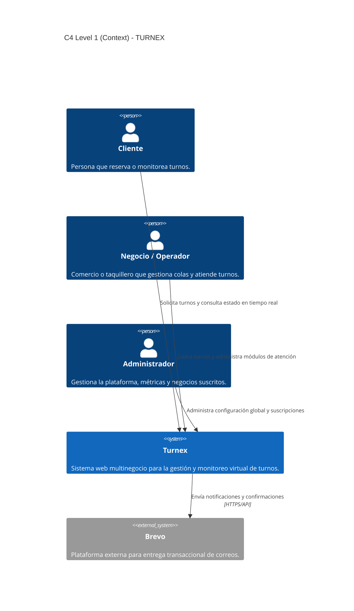

```mermaid
    C4Context
    title C4 Level 1 (Context) - TURNEX

    Person(customer, "Cliente", "Persona que reserva o monitorea turnos.")
    Person(business, "Negocio / Operador", "Comercio o taquillero que gestiona colas y atiende turnos.")
    Person(admin, "Administrador", "Gestiona la plataforma, métricas y negocios suscritos.")

    System(turnex, "Turnex", "Sistema web multinegocio para la gestión y monitoreo virtual de turnos.")
    System_Ext(brevo, "Brevo", "Plataforma externa para entrega transaccional de correos.")

    Rel(customer, turnex, "Solicita turnos y consulta estado en tiempo real")
    Rel(business, turnex, "Llama turnos y administra módulos de atención")
    Rel(admin, turnex, "Administra configuración global y suscripciones")
    Rel(turnex, brevo, "Envía notificaciones y confirmaciones", "HTTPS/API")

    UpdateLayoutConfig($c4shapeInRow="3", $c4BoundaryInRow="1")
```
