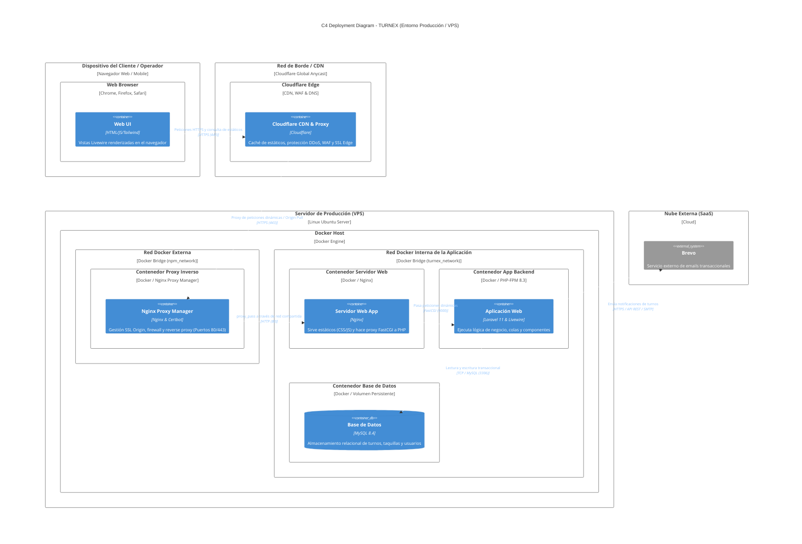

```mermaid
C4Deployment
title C4 Deployment Diagram - TURNEX (Entorno Producción / VPS)

Deployment_Node(client_device, "Dispositivo del Cliente / Operador", "Navegador Web / Mobile") {
    Deployment_Node(browser, "Web Browser", "Chrome, Firefox, Safari") {
        Container(client_app, "Web UI", "HTML/JS/Tailwind", "Vistas Livewire renderizadas en el navegador")
    }
}

Deployment_Node(edge_network, "Red de Borde / CDN", "Cloudflare Global Anycast") {
    Deployment_Node(cf_node, "Cloudflare Edge", "CDN, WAF & DNS") {
        Container(cloudflare, "Cloudflare CDN & Proxy", "Cloudflare", "Caché de estáticos, protección DDoS, WAF y SSL Edge")
    }
}

Deployment_Node(server, "Servidor de Producción (VPS)", "Linux Ubuntu Server") {

    Deployment_Node(docker_host, "Docker Host", "Docker Engine") {

        Deployment_Node(npm_network, "Red Docker Externa", "Docker Bridge (npm_network)") {
            Deployment_Node(reverse_proxy_node, "Contenedor Proxy Inverso", "Docker / Nginx Proxy Manager") {
                Container(proxy, "Nginx Proxy Manager", "Nginx & Certbot", "Gestión SSL Origin, firewall y reverse proxy (Puertos 80/443)")
            }
        }

        Deployment_Node(app_network, "Red Docker Interna de la Aplicación", "Docker Bridge (turnex_network)") {

            Deployment_Node(web_server_node, "Contenedor Servidor Web", "Docker / Nginx") {
                Container(web_server, "Servidor Web App", "Nginx", "Sirve estáticos (CSS/JS) y hace proxy FastCGI a PHP")
            }

            Deployment_Node(app_container_node, "Contenedor App Backend", "Docker / PHP-FPM 8.3") {
                Container(app_instance, "Aplicación Web", "Laravel 11 & Livewire", "Ejecuta lógica de negocio, colas y componentes")
            }

            Deployment_Node(db_container_node, "Contenedor Base de Datos", "Docker / Volumen Persistente") {
                ContainerDb(db_instance, "Base de Datos", "MySQL 8.4", "Almacenamiento relacional de turnos, taquillas y usuarios")
            }
        }
    }
}

Deployment_Node(saas_cloud, "Nube Externa (SaaS)", "Cloud") {
    System_Ext(brevo, "Brevo", "Servicio externo de emails transaccionales")
}

Rel(client_app, cloudflare, "Peticiones HTTPS y consulta de estáticos", "HTTPS (443)")
Rel(cloudflare, proxy, "Proxy de peticiones dinámicas / Origin Pull", "HTTPS (443)")
Rel(proxy, web_server, "proxy_pass a través de red compartida", "HTTP (80)")
Rel(web_server, app_instance, "Pasa peticiones dinámicas", "FastCGI (9000)")
Rel(app_instance, db_instance, "Lectura y escritura transaccional", "TCP / MySQL (3306)")
Rel(app_instance, brevo, "Envía notificaciones de turnos", "HTTPS / API REST / SMTP")

UpdateRelStyle(client_app, cloudflare, $textColor="#93c5fd", $lineColor="#ffffff",$offsetX="-110",$offsetY="-20")
UpdateRelStyle(cloudflare, proxy, $textColor="#93c5fd", $lineColor="#ffffff", $offsetX="-30", $offsetY="-20")
UpdateRelStyle(proxy, web_server, $textColor="#93c5fd", $lineColor="#ffffff", $offsetX="-100", $offsetY="-20")
UpdateRelStyle(web_server, app_instance, $textColor="#93c5fd", $lineColor="#ffffff", $offsetX="-60", $offsetY="-60")
UpdateRelStyle(app_instance, db_instance, $textColor="#93c5fd", $lineColor="#ffffff", $offsetY="-20")
UpdateRelStyle(app_instance, brevo, $textColor="#93c5fd", $lineColor="#ffffff", $offsetY="50")
```
