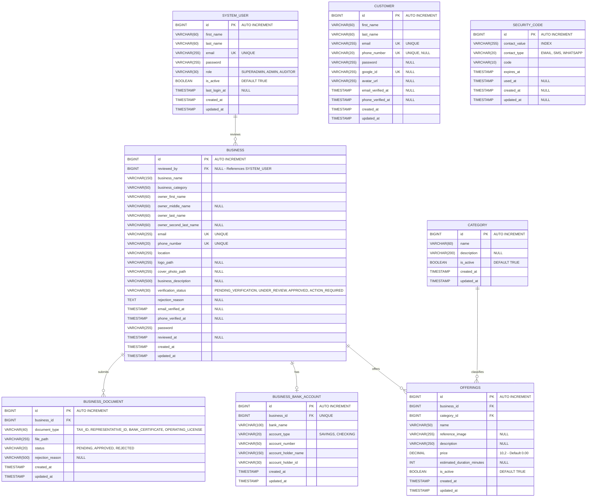

```mermaid
erDiagram
SYSTEM_USER ||--o{ BUSINESS : reviews
BUSINESS ||--o{ OFFERINGS : offers
BUSINESS ||--o| BUSINESS_BANK_ACCOUNT : has
BUSINESS ||--o{ BUSINESS_DOCUMENT : submits
CATEGORY ||--o{ OFFERINGS : classifies

    SYSTEM_USER {
        BIGINT id PK "AUTO INCREMENT"
        VARCHAR(60) first_name
        VARCHAR(60) last_name
        VARCHAR(255) email UK "UNIQUE"
        VARCHAR(255) password
        VARCHAR(30) role "SUPERADMIN, ADMIN, AUDITOR"
        BOOLEAN is_active "DEFAULT TRUE"
        TIMESTAMP last_login_at "NULL"
        TIMESTAMP created_at
        TIMESTAMP updated_at
    }

    CUSTOMER {
        BIGINT id PK "AUTO INCREMENT"
        VARCHAR(60) first_name
        VARCHAR(60) last_name
        VARCHAR(255) email UK "UNIQUE"
        VARCHAR(20) phone_number UK "UNIQUE, NULL"
        VARCHAR(255) password "NULL"
        VARCHAR(255) google_id UK "NULL"
        VARCHAR(255) avatar_url "NULL"
        TIMESTAMP email_verified_at "NULL"
        TIMESTAMP phone_verified_at "NULL"
        TIMESTAMP created_at
        TIMESTAMP updated_at
    }

    BUSINESS {
        BIGINT id PK "AUTO INCREMENT"
        BIGINT reviewed_by FK "NULL - References SYSTEM_USER"
        VARCHAR(150) business_name
        VARCHAR(50) business_category
        VARCHAR(60) owner_first_name
        VARCHAR(60) owner_middle_name "NULL"
        VARCHAR(60) owner_last_name
        VARCHAR(60) owner_second_last_name "NULL"
        VARCHAR(255) email UK "UNIQUE"
        VARCHAR(20) phone_number UK "UNIQUE"
        VARCHAR(255) location
        VARCHAR(255) logo_path "NULL"
        VARCHAR(255) cover_photo_path "NULL"
        VARCHAR(500) business_description "NULL"
        VARCHAR(30) verification_status "PENDING_VERIFICATION, UNDER_REVIEW, APPROVED, ACTION_REQUIRED"
        TEXT rejection_reason "NULL"
        TIMESTAMP email_verified_at "NULL"
        TIMESTAMP phone_verified_at "NULL"
        VARCHAR(255) password
        TIMESTAMP reviewed_at "NULL"
        TIMESTAMP created_at
        TIMESTAMP updated_at
    }

    BUSINESS_BANK_ACCOUNT {
        BIGINT id PK "AUTO INCREMENT"
        BIGINT business_id FK "UNIQUE"
        VARCHAR(100) bank_name
        VARCHAR(20) account_type "SAVINGS, CHECKING"
        VARCHAR(50) account_number
        VARCHAR(150) account_holder_name
        VARCHAR(30) account_holder_id
        TIMESTAMP created_at
        TIMESTAMP updated_at
    }

    BUSINESS_DOCUMENT {
        BIGINT id PK "AUTO INCREMENT"
        BIGINT business_id FK
        VARCHAR(40) document_type "TAX_ID, REPRESENTATIVE_ID, BANK_CERTIFICATE, OPERATING_LICENSE"
        VARCHAR(255) file_path
        VARCHAR(20) status "PENDING, APPROVED, REJECTED"
        VARCHAR(500) rejection_reason "NULL"
        TIMESTAMP created_at
        TIMESTAMP updated_at
    }

    CATEGORY {
        BIGINT id PK "AUTO INCREMENT"
        VARCHAR(60) name
        VARCHAR(200) description "NULL"
        BOOLEAN is_active "DEFAULT TRUE"
        TIMESTAMP created_at
        TIMESTAMP updated_at
    }

    OFFERINGS {
        BIGINT id PK "AUTO INCREMENT"
        BIGINT business_id FK
        BIGINT category_id FK
        VARCHAR(50) name
        VARCHAR(255) reference_image "NULL"
        VARCHAR(250) description "NULL"
        DECIMAL price "10,2 - Default 0.00"
        INT estimated_duration_minutes "NULL"
        BOOLEAN is_active "DEFAULT TRUE"
        TIMESTAMP created_at
        TIMESTAMP updated_at
    }

    SECURITY_CODE {
        BIGINT id PK "AUTO INCREMENT"
        VARCHAR(255) contact_value "INDEX"
        VARCHAR(20) contact_type "EMAIL, SMS, WHATSAPP"
        VARCHAR(10) code
        TIMESTAMP expires_at
        TIMESTAMP used_at "NULL"
        TIMESTAMP created_at "NULL"
        TIMESTAMP updated_at "NULL"
    }
```
